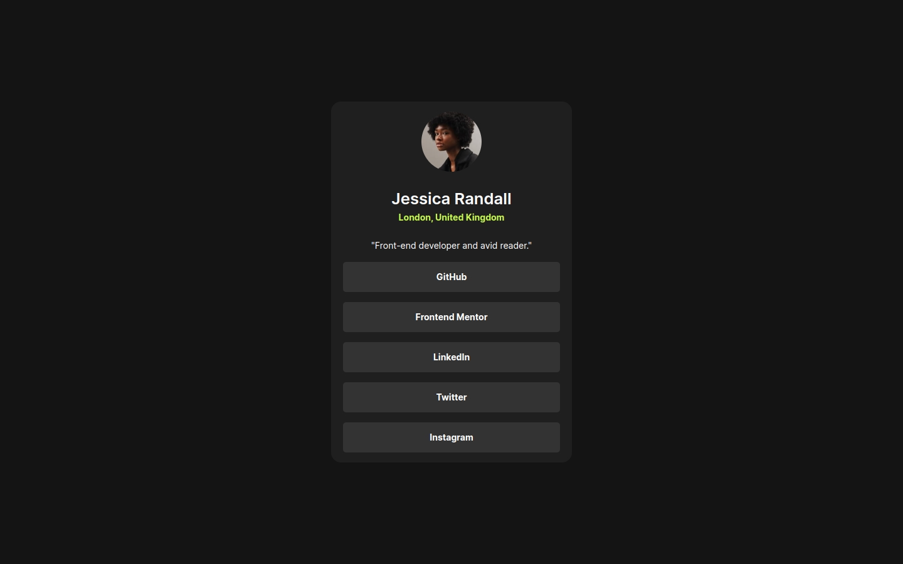
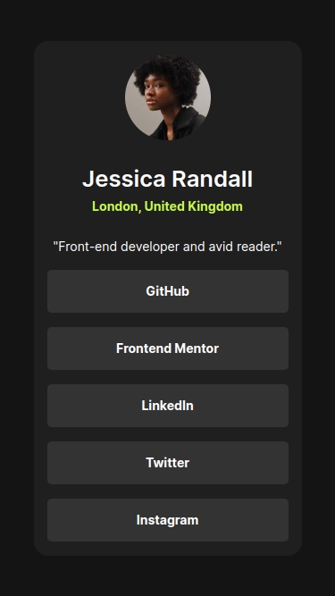

# Frontend Mentor - Social links profile solution

This is a solution to the [Social links profile challenge on Frontend Mentor](https://www.frontendmentor.io/challenges/social-links-profile-UG32l9m6dQ).

## Table of contents

- [Overview](#overview)
  - [The challenge](#the-challenge)
  - [Screenshot](#screenshot)
  - [Links](#links)
- [My process](#my-process)
  - [Built with](#built-with)
  - [What I learned](#what-i-learned)
  - [Continued development](#continued-development)
- [Author](#author)

## Overview

### The challenge

Users should be able to:

- See hover and focus states for all interactive elements on the page

### Screenshot




### Links

- Solution URL: [](https://github.com/anderjackie/social-links-profile)
- Live Site URL: [](https://htmlpreview.github.io/?https://github.com/anderjackie/social-links-profile/blob/main/index.html)

## My process

### Built with

- Semantic HTML5 markup
- CSS custom properties
- Flexbox
- Mobile-first workflow

### What I learned

I think I'm getting more confortable and more confident writing the css styles and building the structure of the page. 

This trick to center a text vertically and horizontally in the middle of a tag was pretty neat.

```css
.link-container > a {
  height: 3rem;
  line-height: 3rem; // Same value as the height
  text-align: center;
  vertical-align: middle;
}
```

### Continued development

I want to be faster so to me it will be continue to put the work

## Author

- Website - [Anderson Moreira Silva](http://mysmallcornerofinternet.life/)
- Frontend Mentor - [@yourusername](https://www.frontendmentor.io/profile/yourusername)
